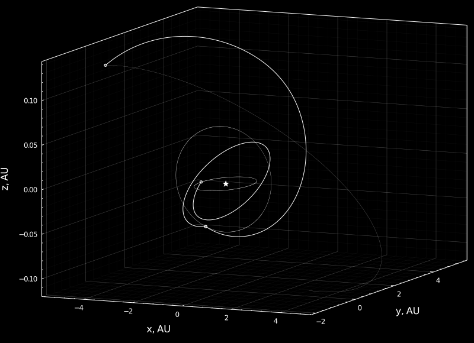

### Hi there 👋

This is Yuri's repo!

  

I spend most of my time designing spacecraft trajectories. 

### Useful public modules

#### Python
- [parivp](https://github.com/Yuricst/parivp) solving IVPs in parallel in Python
- [polaris](https://github.com/Yuricst/polaris): custom astrodynamics library implemented in Python
- [pygmo-helper](https://github.com/Yuricst/pygmo-helper): helper for constructing problems in [`pygmo`](https://esa.github.io/pygmo2/)
- [trajplotlib](https://github.com/Yuricst/trajplotlib): helper toolkit for trajectory plots using matplotlib

#### Julia
- [joptimise](https://github.com/Yuricst/joptimise): Ipopt/SNOPT wrapper in Julia
- [julia-R3BP](https://github.com/Yuricst/julia-R3BP): trajectory design in three-body dynamics with Julia
- [NLPSaUT](https://github.com/Yuricst/NLPSaUT): wrapper for formulating NLP with JuMP

#### MATLAB
- [memoize-fmincon](https://github.com/Yuricst/memoize-fmincon): memoized fmincon wrapper for optimization with complex objective & constraint functions

#### Misc
- [fortran-fantome](https://github.com/Yuricst/fortran-astrodynamics): Fortran subroutines for doing astrodynamics homework faster! 
- [nadesiko-kidou](https://github.com/Yuricst/nadesiko-kidou): trajectory design in nadesiko3

### Work
- [Rsearch Gate](https://www.researchgate.net/profile/Yuri-Shimane)

<!--
### About my GitHub

-->

<!--
**Yuricst/yuricst** is a ✨ _special_ ✨ repository because its `README.md` (this file) appears on your GitHub profile.

Here are some ideas to get you started:

- 🔭 I’m currently working on ...
- 🌱 I’m currently learning ...
- 👯 I’m looking to collaborate on ...
- 🤔 I’m looking for help with ...
- 💬 Ask me about ...
- 📫 How to reach me: ...
- 😄 Pronouns: ...
- ⚡ Fun fact: ...
-->
